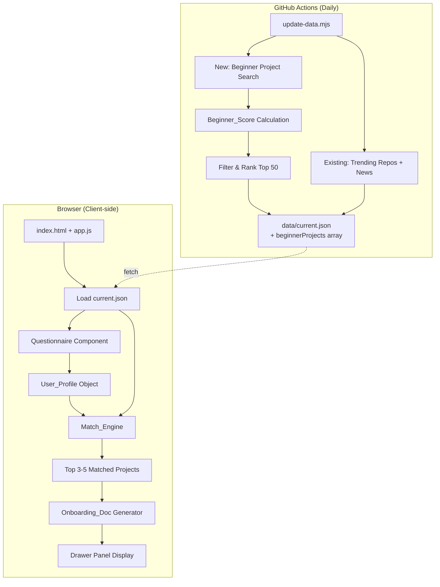

<!-- @AI_GENERATED -->
# Design Document: Enhanced Vibe Coding Recommender

## Overview

本设计将现有推荐模块从"热榜 top-10 中简单推荐"升级为面向零基础用户的完整推荐引擎。系统分为两个执行阶段：

1. **数据管道阶段**（Node.js，每日在 GitHub Actions 中运行）：扩展 `update-data.mjs`，新增 beginner 项目搜索、Beginner_Score 计算，输出 `beginnerProjects` 数组到 `data/current.json`。
2. **客户端阶段**（vanilla JS，静态部署）：新增问卷组件、Match_Engine 匹配算法、入门文档模板生成，全部在浏览器中完成。

关键设计约束：
- 无后端 API、无数据库，所有数据为静态 JSON + 客户端渲染
- 前端纯 vanilla HTML/CSS/JS，无框架无构建工具
- 项目池在数据管道中预计算，Match_Engine 客户端仅做加权评分
- 部署方式为 GitHub Pages + GitHub Actions 每日更新

## Architecture



### Data Flow

1. **采集**：数据管道每日运行 15+ 新的 beginner-focused GitHub 搜索查询
2. **评分**：对每个候选项目计算 Beginner_Score（0-100）
3. **输出**：筛选 top-50 并写入 `beginnerProjects` 字段
4. **加载**：前端 `loadSnapshotData()` 加载 JSON，将 `beginnerProjects` 存入全局变量
5. **问卷**：用户完成 5 步问卷，构建 User_Profile 对象
6. **匹配**：Match_Engine 对 beginnerProjects 逐项计算 match score
7. **展示**：输出 top 3-5 项目卡片，含匹配原因
8. **文档**：用户选择项目后，客户端从模板生成入门文档

## Components and Interfaces

### 1. Data Pipeline Extension (`scripts/update-data.mjs`)

新增函数/常量，不破坏现有 trending + news 逻辑：

```javascript
// 新增常量
const BEGINNER_SEARCH_QUERIES = [...]; // 15+ beginner-specific search queries
const BEGINNER_CATEGORY_TAGS = [...]; // chatbot, knowledge-base, etc.

// 新增函数
async function fetchBeginnerProjects() → RawProject[]
function computeBeginnerScore(project) → { total, breakdown }
function categorizeProject(project) → string[]
function estimateSetupComplexity(project) → "low" | "medium" | "high"
function extractPrerequisiteSkills(project) → string[]
function buildBeginnerProjectPool(rawProjects) → BeginnerProject[]
```

接口协议：`fetchBeginnerProjects` 在 `main()` 中与现有 `fetchGithubRepositories()` 和 `fetchNews()` 并行执行。

### 2. Questionnaire Component (客户端)

```javascript
// 新增到 app.js 中的问卷管理模块
const questionnaireState = {
  currentStep: 0,    // 0-4
  answers: {
    background: null,      // step 0
    goal: null,            // step 1
    interestDirection: [], // step 2 (multi-select)
    timeBudget: null,      // step 3
    environmentPref: null  // step 4
  }
};

function initQuestionnaire() → void
function renderQuestionnaireStep(step) → void
function saveQuestionnaireAnswer(step, value) → void
function buildUserProfile() → UserProfile
function restoreQuestionnaireFromSession() → void
```

问卷数据在浏览器 `sessionStorage` 中持久化，允许刷新后恢复。

### 3. Match Engine (客户端)

```javascript
function computeMatchScore(userProfile, project) → {
  total: number,       // 0-100
  breakdown: { setupComplexity, interestAlignment, timeFeasibility, prerequisiteMatch, goalAlignment },
  reason: string       // 中文匹配原因
}

function runMatchEngine(userProfile, projectPool) → MatchedProject[]
function relaxAndRerun(userProfile, projectPool) → MatchedProject[]
function generateMatchReason(userProfile, project, breakdown) → string
```

### 4. Onboarding Document Generator (客户端)

```javascript
function generateOnboardingDoc(project, userProfile) → OnboardingDoc
function renderOnboardingDocDrawer(doc) → void
function exportOnboardingDocAsMarkdown(doc) → string
function copyOnboardingDocToClipboard(doc) → Promise<boolean>
```

文档生成完全基于模板 + 项目元数据 + 用户画像，不需要 LLM 调用。

### 5. Frontend Integration

新增代码集成到现有 `app.js` 的事件委托机制中，具体集成点：

- `loadSnapshotData()`：新增加载 `beginnerProjects` 数组
- `setActiveSection()`：无需修改，已支持 `recommender` section
- 事件委托：在现有 `document.addEventListener("click", ...)` 中新增问卷与推荐结果的事件处理

## Data Models

### BeginnerProject (数据管道输出)

```typescript
interface BeginnerProject {
  id: number;                          // GitHub repo ID
  name: string;                        // 仓库名
  owner: string;                       // 所有者
  url: string;                         // GitHub URL
  description: string;                 // 英文描述
  descriptionZh: string;               // 中文描述
  categoryTags: string[];              // e.g. ["chatbot", "learning-project"]
  language: string;                    // 主语言
  stars: number;
  beginnerScore: number;               // 0-100
  beginnerScoreBreakdown: {
    readmeQuality: number;             // 0-25
    installInstructions: number;       // 0-20
    dependencySimplicity: number;      // 0-15
    issueResponseRate: number;         // 0-15
    languageAccessibility: number;     // 0-15
    examplesPresence: number;          // 0-10
  };
  setupComplexity: "low" | "medium" | "high";
  prerequisiteSkills: string[];        // e.g. ["basic-terminal", "git-basics"]
  estimatedFirstRunMinutes: number;    // 预计首次运行时间
  hasChineseDocs: boolean;
  hasExamplesFolder: boolean;
  lastUpdated: string;                 // ISO 日期
  topics: string[];                    // GitHub topics
  forks: number;
  openIssues: number;
}
```

### UserProfile (客户端构建)

```typescript
interface UserProfile {
  background: "student" | "product-manager" | "designer" | "marketer"
    | "business-analyst" | "career-changer" | "hobbyist" | "other";
  goal: "build-a-portfolio-project" | "understand-AI-tools"
    | "automate-personal-workflow" | "explore-career-change"
    | "learn-coding-basics" | "build-a-product-idea";
  interestDirections: string[];        // multi-select from predefined list
  timeBudget: "30-minutes-per-day" | "1-hour-per-day"
    | "half-day-per-week" | "full-day-per-week" | "flexible-long-term";
  environmentPreference: "browser-only-no-install" | "simple-local-setup"
    | "docker-comfortable" | "any-environment";
}
```

### MatchResult (Match_Engine 输出)

```typescript
interface MatchResult {
  project: BeginnerProject;
  matchScore: number;                  // 0-100
  breakdown: {
    setupComplexityMatch: number;      // 0-100, weight 30%
    interestAlignment: number;         // 0-100, weight 25%
    timeBudgetFeasibility: number;     // 0-100, weight 20%
    prerequisiteSkillMatch: number;    // 0-100, weight 15%
    goalAlignment: number;             // 0-100, weight 10%
  };
  reason: string;                      // 中文匹配原因
}
```

### OnboardingDoc (文档模板输出)

```typescript
interface OnboardingDoc {
  projectName: string;
  sections: {
    overview: string;
    whyItFitsYou: string;
    environmentSetup: string;          // 包含具体命令和预期输出
    stepByStepInstallation: string;
    firstRunGuide: string;
    directoryStructure: string;
    keyConcepts: string;
    firstModification: string;
    commonErrors: ErrorEntry[];        // >= 5 条
    sevenDayPlan: DayPlan[];           // 7 条，按用户 timeBudget 调整
    portfolioIdeas: string;
  };
  generatedAt: string;
  userTimeBudget: string;
}

interface ErrorEntry {
  errorMessage: string;
  cause: string;
  fix: string;
}

interface DayPlan {
  day: number;
  goal: string;
  estimatedTime: string;
  detail: string;
}
```

### current.json 扩展结构

```json
{
  "generatedAt": "...",
  "date": "...",
  "sources": { ... },
  "scoring": { ... },
  "repositories": [ ... ],         // 现有 trending top-10
  "news": [ ... ],                  // 现有 news
  "beginnerProjects": [ ... ]       // 新增：30-50 beginner-friendly 项目
}
```

### Beginner Search Queries (数据管道配置)

新增 15+ 搜索查询用于发现新手友好项目：

```javascript
const BEGINNER_SEARCH_QUERIES = [
  { query: "topic:chatbot language:python stars:>50", tag: "chatbot" },
  { query: "topic:rag topic:tutorial stars:>50", tag: "knowledge-base" },
  { query: "topic:ai-assistant topic:beginner stars:>50", tag: "coding-assistant" },
  { query: "topic:stable-diffusion topic:webui stars:>100", tag: "image-generation" },
  { query: "topic:automation topic:ai language:python stars:>50", tag: "automation" },
  { query: "topic:browser-extension topic:ai stars:>50", tag: "browser-tool" },
  { query: "topic:cli topic:ai language:python stars:>50", tag: "cli-tool" },
  { query: "topic:nextjs topic:ai stars:>100", tag: "web-app" },
  { query: "topic:openai topic:wrapper stars:>50", tag: "api-wrapper" },
  { query: "topic:tutorial topic:machine-learning stars:>100", tag: "learning-project" },
  { query: "topic:langchain topic:example stars:>50", tag: "knowledge-base" },
  { query: "topic:streamlit topic:ai stars:>50", tag: "web-app" },
  { query: "topic:fastapi topic:ai stars:>50", tag: "api-wrapper" },
  { query: "topic:mcp topic:tool stars:>30", tag: "browser-tool" },
  { query: "topic:agent topic:starter stars:>50", tag: "chatbot" },
  { query: "topic:huggingface topic:demo stars:>50", tag: "learning-project" },
];
```

### Beginner_Score Algorithm

```
Beginner_Score = readmeQuality (0-25)
              + installInstructions (0-20)
              + dependencySimplicity (0-15)
              + issueResponseRate (0-15)
              + languageAccessibility (0-15)
              + examplesPresence (0-10)

readmeQuality:
  - README length > 2000 chars: +10
  - Has headings (## or ###): +5
  - Has code blocks: +5
  - Has badges/shields: +5

installInstructions:
  - Contains "install" or "setup" or "getting started": +10
  - Contains "pip install" or "npm install" or "yarn": +5
  - Contains "docker" with run instructions: +5

dependencySimplicity:
  - < 5 deps in package.json/requirements.txt: +15
  - 5-15 deps: +10
  - 15-30 deps: +5
  - > 30 deps: +0
  (Heuristic: estimate from repo metadata, language, topics)

issueResponseRate:
  - open_issues < 20 AND stars/open_issues > 50: +15
  - open_issues < 50 AND stars/open_issues > 20: +10
  - else: +5

languageAccessibility:
  - Python: +15 (easiest for beginners)
  - JavaScript/TypeScript: +12
  - Has Chinese in description/topics: +3 bonus
  - Rust/C++/Go: +5

examplesPresence:
  - Topics contain "example", "tutorial", "demo", "starter": +10
  - Topics contain "beginner" or "learning": +5
  - else: +0
```

### Match_Engine Scoring Algorithm

```
matchScore = setupComplexityMatch × 0.30
           + interestAlignment × 0.25
           + timeBudgetFeasibility × 0.20
           + prerequisiteSkillMatch × 0.15
           + goalAlignment × 0.10

setupComplexityMatch:
  Mapping: browser-only → low required
           simple-local-setup → medium allowed
           docker-comfortable → high allowed
           any-environment → all allowed
  Score: at-or-below = 100, one-above = 50, two-above = 0

interestAlignment:
  Exact match between user interestDirections and project categoryTags = 100
  Related category = 60
  No match = 0
  (Average if multiple interests selected)

timeBudgetFeasibility:
  Map time budgets to max acceptable estimatedFirstRunMinutes:
    30-minutes-per-day → 30 min
    1-hour-per-day → 60 min
    half-day-per-week → 120 min
    full-day-per-week → 240 min
    flexible-long-term → unlimited (100)
  Score: project.estimatedFirstRunMinutes <= budget → 100
         project.estimatedFirstRunMinutes <= budget×2 → 50
         else → 0

prerequisiteSkillMatch:
  Count project prerequisite skills user likely has (inferred from background):
    student → ["basic-terminal", "git-basics"]
    product-manager → ["basic-web-browsing"]
    designer → ["basic-web-browsing", "basic-html"]
    etc.
  Score: (matched_skills / total_required_skills) × 100

goalAlignment:
  Map user goals to preferred category tags:
    build-a-portfolio-project → ["web-app", "chatbot"]
    understand-AI-tools → ["learning-project", "api-wrapper"]
    automate-personal-workflow → ["automation", "cli-tool", "browser-tool"]
    etc.
  Score: overlap ? 100 : partial ? 60 : 0
```


## Correctness Properties

*A property is a characteristic or behavior that should hold true across all valid executions of a system—essentially, a formal statement about what the system should do. Properties serve as the bridge between human-readable specifications and machine-verifiable correctness guarantees.*

### Property 1: Beginner project filter correctness

*For any* GitHub repository object, the filter function SHALL accept it if and only if it has README length > 500 characters, stars >= 50, and push date within the last 90 days; otherwise it SHALL reject it.

**Validates: Requirements 1.2, 5.3**

### Property 2: Beginner_Score bounded and breakdown sum invariant

*For any* valid project metadata input, the computed Beginner_Score SHALL be an integer in the range [0, 100], and the sum of the breakdown components (readmeQuality + installInstructions + dependencySimplicity + issueResponseRate + languageAccessibility + examplesPresence) SHALL equal the total Beginner_Score.

**Validates: Requirements 1.3**

### Property 3: Project pool output size and ordering

*For any* set of candidate projects that passes filtering and has more than 50 items, the output beginnerProjects array SHALL contain exactly 50 items sorted in descending order by Beginner_Score; if fewer than 50 candidates pass, all passing candidates with score >= 40 SHALL be included, and the array size SHALL be between 30 and 50 (inclusive) after a successful pipeline run.

**Validates: Requirements 1.4, 5.5, 7.2**

### Property 4: Category tag assignment completeness

*For any* project in the output beginnerProjects array, it SHALL have at least one categoryTag from the valid set {chatbot, knowledge-base, coding-assistant, image-generation, automation, browser-tool, cli-tool, web-app, api-wrapper, learning-project}.

**Validates: Requirements 1.5**

### Property 5: Output schema structural completeness

*For any* project in the beginnerProjects output array, the object SHALL contain all required fields (id, name, owner, url, description, descriptionZh, categoryTags, language, stars, beginnerScore, beginnerScoreBreakdown, setupComplexity, prerequisiteSkills, estimatedFirstRunMinutes, hasChineseDocs, hasExamplesFolder, lastUpdated) with correct types.

**Validates: Requirements 1.6, 5.2**

### Property 6: Questionnaire state preservation on backward navigation

*For any* sequence of answers provided across questionnaire steps, navigating backward to any previous step SHALL preserve all already-selected answers; navigating forward again SHALL still show the previously selected values.

**Validates: Requirements 2.8, 6.7**

### Property 7: Match score weighted sum invariant

*For any* UserProfile and BeginnerProject pair, the computed matchScore SHALL equal setupComplexityMatch × 0.30 + interestAlignment × 0.25 + timeBudgetFeasibility × 0.20 + prerequisiteSkillMatch × 0.15 + goalAlignment × 0.10, rounded to integer, and the result SHALL be in range [0, 100].

**Validates: Requirements 3.1, 7.3**

### Property 8: Setup complexity match mapping correctness

*For any* combination of user environmentPreference and project setupComplexity, the setupComplexityMatch score SHALL be exactly 100 when project complexity is at or below user preference level, 50 when one level above, and 0 when two or more levels above.

**Validates: Requirements 3.2**

### Property 9: Interest alignment monotonicity

*For any* user interestDirections set and project categoryTags set, an exact match between a user interest and a project tag SHALL produce a higher interestAlignment score than a partial/related match, which SHALL produce a higher score than no match at all.

**Validates: Requirements 3.3**

### Property 10: Match result set constraints

*For any* completed user profile and project pool, the Match_Engine output SHALL contain between 3 and 5 projects, each with matchScore >= 40, sorted in descending order by matchScore. If the initial run yields fewer than 3 results above threshold, the engine SHALL relax the setup-complexity constraint by one level and recompute.

**Validates: Requirements 3.4, 3.5**

### Property 11: Match reason is non-empty Chinese without jargon

*For any* matched project-profile pair, the generated recommendation reason SHALL be a non-empty string containing Chinese characters and SHALL NOT contain English technical jargon terms (e.g., "API", "SDK", "framework", "container" without Chinese explanation).

**Validates: Requirements 3.6**

### Property 12: Onboarding document structural completeness

*For any* BeginnerProject and UserProfile combination, the generated OnboardingDoc SHALL contain all 11 required sections (overview, whyItFitsYou, environmentSetup, stepByStepInstallation, firstRunGuide, directoryStructure, keyConcepts, firstModification, commonErrors, sevenDayPlan, portfolioIdeas), each with non-empty content.

**Validates: Requirements 4.1**

### Property 13: Common errors section minimum count

*For any* generated OnboardingDoc, the commonErrors array SHALL contain at least 5 entries, and each entry SHALL have non-empty errorMessage, cause, and fix fields.

**Validates: Requirements 4.4**

### Property 14: Seven-day plan time budget adherence

*For any* generated OnboardingDoc with a given user timeBudget, the sevenDayPlan SHALL contain exactly 7 entries where each day's estimatedTime does not exceed the user's declared time budget, and each day's goal builds incrementally upon the previous day.

**Validates: Requirements 4.5**

### Property 15: Dismissal exclusion persistence

*For any* project ID recorded as dismissed in localStorage, subsequent calls to the Match_Engine SHALL exclude that project from recommendation results regardless of its match score.

**Validates: Requirements 7.4**

## Error Handling

### Data Pipeline Errors

| Error Scenario | Handling Strategy |
|---|---|
| GitHub API rate limit / 403 | Log warning, retain previous `beginnerProjects` from last snapshot |
| GitHub API timeout | Retry once after 3s, then fall back to previous snapshot |
| All beginner queries fail | Keep previous `beginnerProjects` data; log error |
| Some queries fail (partial) | Process successful queries only; if results >= 30 after scoring, proceed; otherwise fall back |
| README fetch fails for scoring | Assign conservative score estimates based on available metadata only |
| Output validation fails (< 30 projects) | Merge with previous snapshot's projects to reach minimum 30 |

### Client-side Errors

| Error Scenario | Handling Strategy |
|---|---|
| `current.json` fetch fails | Use bundled fallback `beginnerProjects` array (hardcoded demo data, same as existing trending approach) |
| `beginnerProjects` array missing from JSON | Show message "推荐数据暂未就绪，请稍后重试" in recommender section |
| Match_Engine produces 0 results after relaxation | Display "暂无匹配项目，请调整问卷答案" with button to reset questionnaire |
| sessionStorage unavailable | Questionnaire works normally but answers are not preserved across navigation |
| Clipboard API fails (copy doc) | Fall back to `document.execCommand('copy')`, show toast on failure "复制失败，请手动选择文本" |
| Project URL unreachable | Not validated client-side; trust pipeline output |

### Validation Rules

- Beginner_Score: clamp to [0, 100], reject < 0 or > 100
- matchScore: clamp to [0, 100]
- beginnerProjects array: must be Array, length validation [0, 50]
- UserProfile: all fields required before Match_Engine executes; partial profiles trigger warning

## Testing Strategy

### Unit Tests (Example-based)

Unit tests focus on specific scenarios and configuration validation:

1. **Questionnaire structure**: Verify exactly 5 steps with correct option sets (Req 2.1-2.6)
2. **UI rendering**: Entry point label, progress indicator, card fields, drawer buttons (Req 6.1-6.6)
3. **Pipeline config**: At least 15 search queries configured (Req 1.1)
4. **Output structure**: `beginnerProjects` field exists in pipeline output (Req 5.1)
5. **Timestamp display**: Data generation timestamp visible (Req 7.5)
6. **Option explanations**: Each option shows explanation on selection (Req 2.7)

### Property-Based Tests

Property-based tests validate universal properties across 100+ generated inputs. Library: **fast-check** (JavaScript PBT library, zero dependencies, works in Node.js without build tools).

Each property test maps to a design property and runs a minimum of 100 iterations.

| Property # | Test Description | Generator Strategy |
|---|---|---|
| 1 | Filter correctness | Random repo objects with varying README length, stars, push date |
| 2 | Score bounded + breakdown sum | Random project metadata with all scoring attributes |
| 3 | Output size and ordering | Random lists of 10-200 scored projects |
| 4 | Category tag assignment | Random projects with varying topics/descriptions |
| 5 | Schema completeness | Random project inputs through full pipeline transform |
| 6 | Questionnaire preservation | Random answer sequences with forward/backward navigation |
| 7 | Weighted sum invariant | Random UserProfile + BeginnerProject pairs |
| 8 | Complexity mapping | All enum combinations (exhaustive, 4×3=12 cases + random) |
| 9 | Interest alignment monotonicity | Random interest sets + tag sets with controlled overlaps |
| 10 | Result set constraints | Random pools of 10-60 projects with varying scores |
| 11 | Reason quality | Random profile-project pairs, check Chinese presence |
| 12 | Doc structural completeness | Random project-profile pairs through doc generator |
| 13 | Common errors minimum | Random projects through error section generator |
| 14 | 7-day plan time adherence | Random time budgets through plan generator |
| 15 | Dismissal exclusion | Random dismiss sequences + re-runs |

**Tag format**: `Feature: enhanced-recommender, Property {N}: {property_text}`

### Integration Tests

- Pipeline end-to-end: Run `update-data.mjs` with mocked GitHub API, verify output JSON schema
- Frontend load: Verify `loadSnapshotData()` correctly parses `beginnerProjects`
- Full flow: Complete questionnaire → match → view doc (manual or Playwright)

### Test Configuration

```json
{
  "testRunner": "node --test (Node.js built-in test runner)",
  "pbtLibrary": "fast-check",
  "minIterations": 100,
  "testLocation": "tests/",
  "coverage": "not required (no build tools)"
}
```

<!-- @AI_GENERATED: end -->
